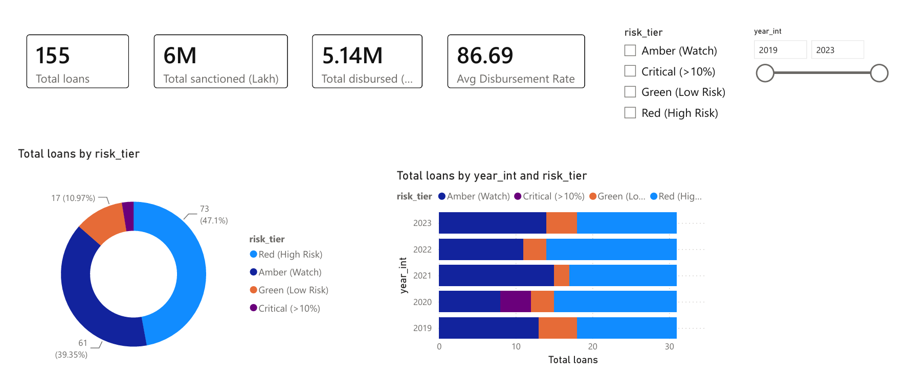
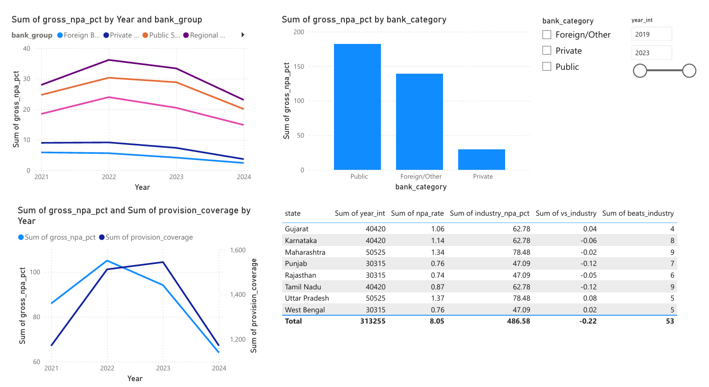
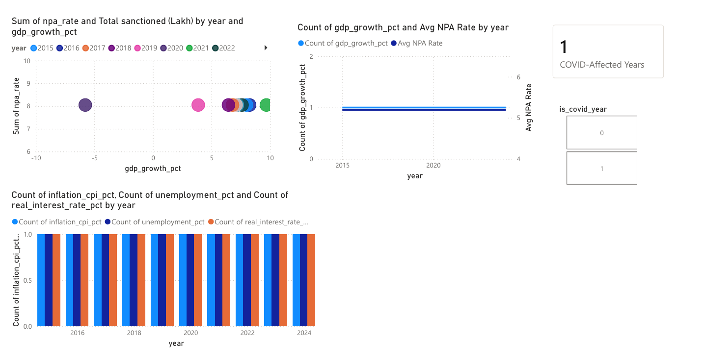

# BFSI Risk Analytics Pipeline

End-to-end personal data engineering project: 3 public data sources -> Python ETL -> Google BigQuery (star schema) -> Power BI dashboard, orchestrated with Apache Airflow.

**Read this before you run anything:** this code is a reference implementation, not a copy-paste-and-ship kit. Per the build checklist, retype and understand each function yourself, verify the actual data.gov.in column names against your real API response (they're placeholders here), and adjust the logic to match what you actually get back. That's what makes this defensible in an interview.

## Architecture

```
RBI DBIE API      -> extract_rbi()   -┐
data.gov.in API   -> extract_loans() -┤-> transform -> star schema in BigQuery -> Power BI
World Bank API     -> extract_macro() -┘
                          ^ Airflow DAG runs daily at 6 AM (0 6 * * *)
```

## Project structure

```
bfsi-risk-analytics-pipeline/
  etl/
    utils.py       - get_logger(), parse_fiscal_year(), parse_rbi_quarter()
    extract.py     - extract_rbi(), extract_loans() (paginated), extract_macro()
    transform.py   - clean_rbi(), clean_loans(), clean_macro(), join_all()
    load.py        - get_bq_client(), load_table() (WRITE_TRUNCATE)
    main.py        - run_pipeline() orchestrator
  dags/
    bfsi_dag.py    - Airflow DAG: extract >> transform >> load
  sql/
    create_tables.sql - star schema DDL + validation query
  requirements.txt
  .env.example     - copy to .env and fill in your own keys (never commit .env)
  .gitignore
```

## Setup

1. `python -m venv venv` then activate it
2. `pip install -r requirements.txt`
3. Copy `.env.example` to `.env`, fill in your RBI and data.gov.in API keys
4. Create a Google Cloud project + BigQuery dataset `bfsi_warehouse`, download a service account key as `gcp_key.json` in the project root
5. `cd etl && python main.py`

## Known gap fixed from the original design doc

The original walkthrough's `join_all()` referenced a `bank_type_mapped` column on the loans dataset that's never created anywhere - it would have thrown a `KeyError` at runtime. This version benchmarks against the overall industry-average NPA% per year instead of a per-bank-category figure, since the MSME loan dataset has no bank-category field. Worth mentioning if asked about debugging the project - it's a real example of a bug you caught and fixed.

## Orchestration options

- **Docker available (4GB+ free RAM):** run Airflow via `docker run -p 8080:8080 apache/airflow:latest`, point it at `dags/bfsi_dag.py`
- **No Docker:** schedule `etl/main.py` via Windows Task Scheduler daily. Note this honestly in interviews rather than claiming Airflow if you didn't run it.

## Next steps

See `Pragati_DE_Project_Build_Checklist.md` for the full phase-by-phase build plan, and `Pragati_Interview_Prep_Project_QA.md` for how to talk about this in interviews.

## Dashboard

### Risk Overview


### Delinquency Deep Dive


### Macro vs Credit Risk


### Portfolio Segmentation
