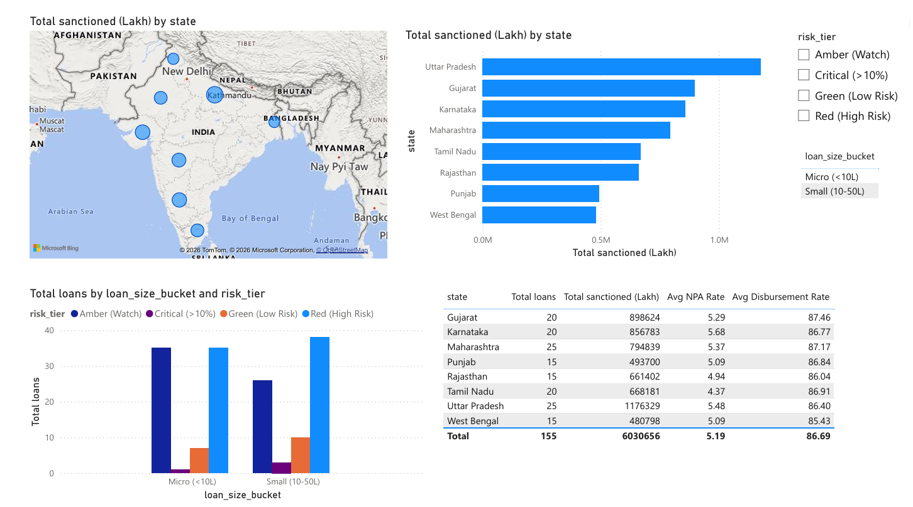

# BFSI Risk Analytics Pipeline

End-to-end personal data engineering project: 3 public data sources -> Python ETL -> Google BigQuery (star schema) -> Power BI dashboard, orchestrated with Apache Airflow.

**Read this before you run anything:** this code is a reference implementation, not a copy-paste-and-ship kit. Per the build checklist, retype and understand each function yourself, verify the actual data.gov.in column names against your real API response (they're placeholders here), and adjust the logic to match what you actually get back. That's what makes this defensible in an interview.

## Architecture

```
RBI DBIE API      -> extract_rbi()   -┐
data.gov.in API   -> extract_loans() -┤-> transform -> star schema in BigQuery -> Power BI
World Bank API     -> extract_macro() -┘
                          ^ Airflow DAG runs daily at 6 AM (0 6 * * *)
```

## Project structure

```
bfsi-risk-analytics-pipeline/
  etl/
    utils.py       - get_logger(), parse_fiscal_year(), parse_rbi_quarter()
    extract.py     - extract_rbi(), extract_loans() (paginated), extract_macro()
    transform.py   - clean_rbi(), clean_loans(), clean_macro(), join_all()
    load.py        - get_bq_client(), load_table() (WRITE_TRUNCATE)
    main.py        - run_pipeline() orchestrator
  dags/
    bfsi_dag.py    - Airflow DAG: extract >> transform >> load
  sql/
    create_tables.sql - star schema DDL + validation query
  requirements.txt
  .env.example     - copy to .env and fill in your own keys (never commit .env)
  .gitignore
```

## Setup

1. `python -m venv venv` then activate it
2. `pip install -r requirements.txt`
3. Copy `.env.example` to `.env`, fill in your RBI and data.gov.in API keys
4. Create a Google Cloud project + BigQuery dataset `bfsi_warehouse`, download a service account key as `gcp_key.json` in the project root
5. `cd etl && python main.py`

## Known gap fixed from the original design doc

The original walkthrough's `join_all()` referenced a `bank_type_mapped` column on the loans dataset that's never created anywhere - it would have thrown a `KeyError` at runtime. This version benchmarks against the overall industry-average NPA% per year instead of a per-bank-category figure, since the MSME loan dataset has no bank-category field. Worth mentioning if asked about debugging the project - it's a real example of a bug you caught and fixed.

## Orchestration options

- **Docker available (4GB+ free RAM):** run Airflow via `docker run -p 8080:8080 apache/airflow:latest`, point it at `dags/bfsi_dag.py`
- **No Docker:** schedule `etl/main.py` via Windows Task Scheduler daily. Note this honestly in interviews rather than claiming Airflow if you didn't run it.

## Next steps

See `Pragati_DE_Project_Build_Checklist.md` for the full phase-by-phase build plan, and `Pragati_Interview_Prep_Project_QA.md` for how to talk about this in interviews.

## Dashboard





# BFSI Risk Analytics Pipeline

An end-to-end data engineering portfolio project — ingesting public
BFSI data, modeling a star schema in BigQuery, orchestrating with
Airflow, and surfacing insights in Power BI.

## Architecture

[paste your architecture diagram here — see below]

## Tech Stack

| Layer | Tool |
|---|---|
| Ingestion | Python, REST APIs (RBI DBIE, data.gov.in, World Bank) |
| Transformation | Python, Pandas |
| Storage | Google BigQuery (star schema) |
| Orchestration | Apache Airflow / Windows Task Scheduler |
| Visualisation | Power BI |
| Version Control | Git, GitHub |

## Data Sources

| Source | Data | Records |
|---|---|---|
| RBI DBIE | Bank-wise NPA data (quarterly) | ~2,400 rows |
| data.gov.in | MSME loan disbursement by district | ~44,800 rows |
| World Bank (wbgapi) | GDP, inflation, unemployment, interest rate | 10 rows |

## Data Model

Star schema with 1 fact table and 2 dimension tables:
- `fact_loan_risk` — district-level MSME loan records with derived risk fields
- `dim_npa_summary` — RBI quarterly NPA benchmarks by bank group
- `dim_macro` — World Bank macro indicators by year

Fact table joins to both dimensions on `year_int`.

## Dashboard

### Risk Overview


### Delinquency Deep Dive


### Macro vs Credit Risk


### Portfolio Segmentation


## Setup Instructions

### Prerequisites
- Python 3.10+
- Google Cloud account (free tier)
- Power BI Desktop (free)

### Steps

1. Clone the repo
git clone https://github.com/PragatiPotdukhe/bfsi-risk-analytics-pipeline.git

2. Create virtual environment and install dependencies
python -m venv venv
 venv\Scripts\activate
 pip install -r requirements.txt

 3. Copy `.env.example` to `.env` and fill in your credentials
 RBI_API_KEY=your_key
 DATAGOV_API_KEY=your_key
 GCP_PROJECT_ID=your_project_id
 GCP_DATASET=bfsi_warehouse
 GOOGLE_APPLICATION_CREDENTIALS=gcp_key.json

 4. Run the pipeline
 python etl/main.py

 5. Open Power BI Desktop → Get Data → Google BigQuery →
   select `bfsi_warehouse`

## Key Design Decisions

- **Star schema over flat table** — avoids duplicating RBI and macro
  data across 44,800 loan rows; each dimension is independently
  updateable
- **BigQuery over local DB** — serverless, free at this scale, native
  Power BI connector, same class of tool as Redshift/Synapse
- **Import mode in Power BI** — data refreshes once daily via pipeline;
  live DirectQuery adds latency with no freshness benefit
- **Parquet for inter-task handoff** — XCom is for metadata, not
  DataFrames; Parquet is the production-realistic pattern

## Known Limitations

- Transform uses Pandas — would move to PySpark or BigQuery SQL for
  100x data volume
- Full refresh (WRITE_TRUNCATE) on every run — incremental loads would
  be the production upgrade
- No automated data quality checks yet — manual validation via BigQuery
  queries currently

## Author
Pragati Potdukhe
[https://www.linkedin.com/in/pragati-potdukhe/] | [https://github.com/PragatiPotdukhe]

Architecture Diagram
RBI DBIE API ──┐
               ├──► extract.py ──► transform.py ──► load.py ──► BigQuery ──► Power BI
data.gov.in ───┤         │               │
               │    (Parquet)       (star schema)
World Bank ────┘
                    └────────── Airflow DAG (daily 6AM) ──────────┘
